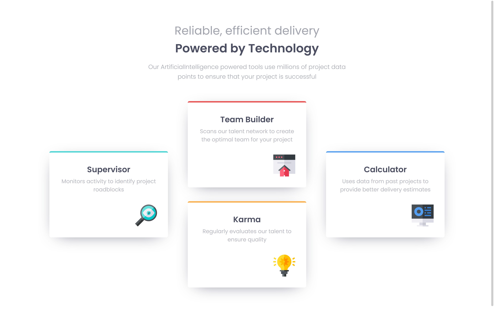

# Four card feature section solution

This is a solution to the [Four card feature section challenge on Frontend Mentor](https://www.frontendmentor.io/challenges/four-card-feature-section-weK1eFYK). Frontend Mentor challenges help you improve your coding skills by building realistic projects.

## Table of contents

- [Overview](#overview)
  - [The challenge](#the-challenge)
  - [Screenshot](#screenshot)
  - [Links](#links)
- [My process](#my-process)
  - [Built with](#built-with)
  - [What I learned](#what-i-learned)
  - [Useful resources](#useful-resources)
- [Author](#author)

## Overview

### The challenge

Users should be able to:

- View the optimal layout for the site depending on their device's screen size

### Screenshot




### Links

- Live Site URL: [Four card feature section solution](https://sunil-sharma-999.github.io/Four-card-feature-section/)

## My process

### Built with

- HTML
- CSS
- CSS Grid
- Mobile-first workflow

### What I learned

I used my CSS Grid knowledge in this project after learning CSS Grid. It helped me solidify my knowledge on the topic.

And, I also learned something new, which is how to position the cards on grid the way its shown.

#### CSS Code:

```css
.container {
  display: grid;
  grid-template-rows: 1fr 1fr;
  grid-template-columns: 1fr 1fr 1fr;
  grid-template-areas: 'card1 card2 card4' 'card1 card3 card4';
}
/* Assigning namesto use in Grid Template Areas */
.card1 {
  grid-area: card1;
}
.card2 {
  grid-area: card2;
}
.card3 {
  grid-area: card3;
}
.card4 {
  grid-area: card4;
}
/* making the first card and last card align in center */
.card1,
.card4 {
  align-self: center;
}
```

### Useful resources

- [CSS-Tricks](https://css-tricks.com/) - This site is very helpful and have many amazing articles that helped me. My main focus in this project was CSS Grid and the CSS Tricks Grid guide was very handy and useful.

## Author

- GitHub - [Sunil Sharma](https://github.com/sunil-sharma-999/)
- Frontend Mentor - [@sunil-sharma-999](https://www.frontendmentor.io/profile/sunil-sharma-999)
- Instagram - [@sunil-sharma-9](https://www.instagram.com/sunil.sharma.9)
